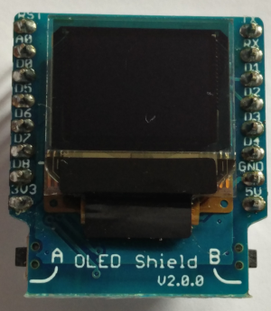
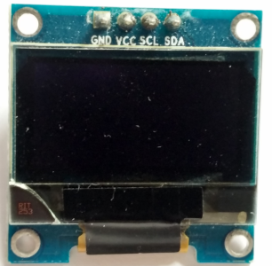

## OLED Display
Currently supported are displays using SSD1306 controller.

### Wemos Shield 64x48



| Shield | Signal | Raspi |
|---:|:---:|:---|
| D1 | SCL | 5 - GPIO3
| D2 | SDA | 3 - GPIO2
| GND |  | 9 - GND
| 3v3 |  | 1 - 3v3

### AZ Delivery OLED 128x64



| Display | Raspi |
|---:|:---|
| SCL | 5 - GPIO3
| SDA | 3 - GPIO2
| GND | 9 - GND
| 3v3 | 1 - 3v3


### How to use

``` csharp
    // select a display profile
    var profile = OledProfile.WemosShield64x48;
    // create i2c connection
    var i2c = new I2C();
    i2c.Open("/dev/i2c-1", profile.Address[0]);
    // create display
    _display = new OledDisplaySSD1306(i2c, profile);
    // initialize driver
    _display.Initialize();
    // clear display
    _display.Clear();
    // select a font
    _display.SetFont(OledFonts.ArialPlain10);
    // draw some text
    _display.DrawString(1, 1, "Start ...");
    // update display contents
    _display.UpdateDisplay();
``` 
